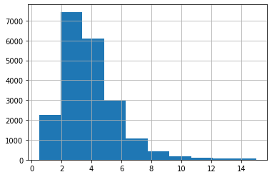
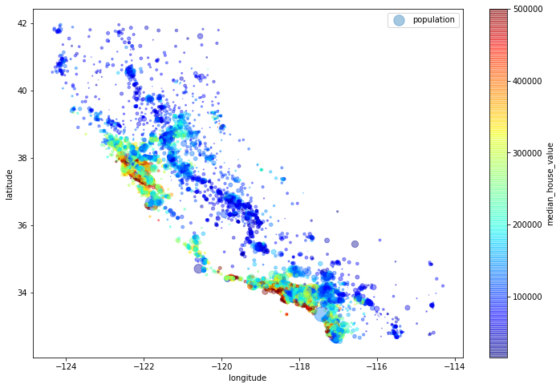
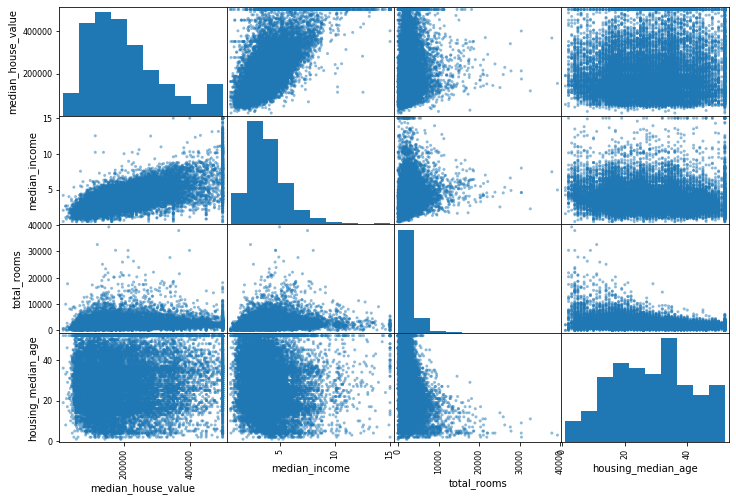
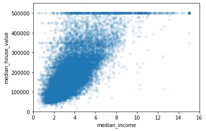
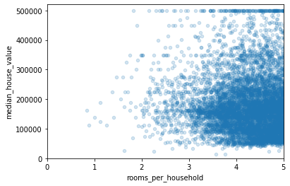

# California Housing Price Prediction


```python
import numpy as np
import pandas as pd
import matplotlib.pyplot as plt
%matplotlib inline
```


```python
housing = pd.read_csv("housing.csv")
housing.head(3)
```


<div>
<style scoped>
    .dataframe tbody tr th:only-of-type {
        vertical-align: middle;
    }

    .dataframe tbody tr th {
        vertical-align: top;
    }

    .dataframe thead th {
        text-align: right;
    }
</style>
<table border="1" class="dataframe">
  <thead>
    <tr style="text-align: right;">
      <th></th>
      <th>longitude</th>
      <th>latitude</th>
      <th>housing_median_age</th>
      <th>total_rooms</th>
      <th>total_bedrooms</th>
      <th>population</th>
      <th>households</th>
      <th>median_income</th>
      <th>median_house_value</th>
      <th>ocean_proximity</th>
    </tr>
  </thead>
  <tbody>
    <tr>
      <td>0</td>
      <td>-122.23</td>
      <td>37.88</td>
      <td>41.0</td>
      <td>880.0</td>
      <td>129.0</td>
      <td>322.0</td>
      <td>126.0</td>
      <td>8.3252</td>
      <td>452600.0</td>
      <td>NEAR BAY</td>
    </tr>
    <tr>
      <td>1</td>
      <td>-122.22</td>
      <td>37.86</td>
      <td>21.0</td>
      <td>7099.0</td>
      <td>1106.0</td>
      <td>2401.0</td>
      <td>1138.0</td>
      <td>8.3014</td>
      <td>358500.0</td>
      <td>NEAR BAY</td>
    </tr>
    <tr>
      <td>2</td>
      <td>-122.24</td>
      <td>37.85</td>
      <td>52.0</td>
      <td>1467.0</td>
      <td>190.0</td>
      <td>496.0</td>
      <td>177.0</td>
      <td>7.2574</td>
      <td>352100.0</td>
      <td>NEAR BAY</td>
    </tr>
  </tbody>
</table>
</div>


```python
housing.info()
```

    <class 'pandas.core.frame.DataFrame'>
    RangeIndex: 20640 entries, 0 to 20639
    Data columns (total 10 columns):
    longitude             20640 non-null float64
    latitude              20640 non-null float64
    housing_median_age    20640 non-null float64
    total_rooms           20640 non-null float64
    total_bedrooms        20433 non-null float64
    population            20640 non-null float64
    households            20640 non-null float64
    median_income         20640 non-null float64
    median_house_value    20640 non-null float64
    ocean_proximity       20640 non-null object
    dtypes: float64(9), object(1)
    memory usage: 1.6+ MB
    

#### there are 20640 instances & 'total_bedrooms' has only 20433 non-null values (207 values missing)


```python
housing['ocean_proximity'].value_counts()
```


    <1H OCEAN     9136
    INLAND        6551
    NEAR OCEAN    2658
    NEAR BAY      2290
    ISLAND           5
    Name: ocean_proximity, dtype: int64


```python
housing.describe()
```


<div>
<style scoped>
    .dataframe tbody tr th:only-of-type {
        vertical-align: middle;
    }

    .dataframe tbody tr th {
        vertical-align: top;
    }

    .dataframe thead th {
        text-align: right;
    }
</style>
<table border="1" class="dataframe">
  <thead>
    <tr style="text-align: right;">
      <th></th>
      <th>longitude</th>
      <th>latitude</th>
      <th>housing_median_age</th>
      <th>total_rooms</th>
      <th>total_bedrooms</th>
      <th>population</th>
      <th>households</th>
      <th>median_income</th>
      <th>median_house_value</th>
    </tr>
  </thead>
  <tbody>
    <tr>
      <td>count</td>
      <td>20640.000000</td>
      <td>20640.000000</td>
      <td>20640.000000</td>
      <td>20640.000000</td>
      <td>20433.000000</td>
      <td>20640.000000</td>
      <td>20640.000000</td>
      <td>20640.000000</td>
      <td>20640.000000</td>
    </tr>
    <tr>
      <td>mean</td>
      <td>-119.569704</td>
      <td>35.631861</td>
      <td>28.639486</td>
      <td>2635.763081</td>
      <td>537.870553</td>
      <td>1425.476744</td>
      <td>499.539680</td>
      <td>3.870671</td>
      <td>206855.816909</td>
    </tr>
    <tr>
      <td>std</td>
      <td>2.003532</td>
      <td>2.135952</td>
      <td>12.585558</td>
      <td>2181.615252</td>
      <td>421.385070</td>
      <td>1132.462122</td>
      <td>382.329753</td>
      <td>1.899822</td>
      <td>115395.615874</td>
    </tr>
    <tr>
      <td>min</td>
      <td>-124.350000</td>
      <td>32.540000</td>
      <td>1.000000</td>
      <td>2.000000</td>
      <td>1.000000</td>
      <td>3.000000</td>
      <td>1.000000</td>
      <td>0.499900</td>
      <td>14999.000000</td>
    </tr>
    <tr>
      <td>25%</td>
      <td>-121.800000</td>
      <td>33.930000</td>
      <td>18.000000</td>
      <td>1447.750000</td>
      <td>296.000000</td>
      <td>787.000000</td>
      <td>280.000000</td>
      <td>2.563400</td>
      <td>119600.000000</td>
    </tr>
    <tr>
      <td>50%</td>
      <td>-118.490000</td>
      <td>34.260000</td>
      <td>29.000000</td>
      <td>2127.000000</td>
      <td>435.000000</td>
      <td>1166.000000</td>
      <td>409.000000</td>
      <td>3.534800</td>
      <td>179700.000000</td>
    </tr>
    <tr>
      <td>75%</td>
      <td>-118.010000</td>
      <td>37.710000</td>
      <td>37.000000</td>
      <td>3148.000000</td>
      <td>647.000000</td>
      <td>1725.000000</td>
      <td>605.000000</td>
      <td>4.743250</td>
      <td>264725.000000</td>
    </tr>
    <tr>
      <td>max</td>
      <td>-114.310000</td>
      <td>41.950000</td>
      <td>52.000000</td>
      <td>39320.000000</td>
      <td>6445.000000</td>
      <td>35682.000000</td>
      <td>6082.000000</td>
      <td>15.000100</td>
      <td>500001.000000</td>
    </tr>
  </tbody>
</table>
</div>


```python
housing[['ocean_proximity','median_house_value']].groupby('ocean_proximity').mean()
```


<div>
<style scoped>
    .dataframe tbody tr th:only-of-type {
        vertical-align: middle;
    }

    .dataframe tbody tr th {
        vertical-align: top;
    }

    .dataframe thead th {
        text-align: right;
    }
</style>
<table border="1" class="dataframe">
  <thead>
    <tr style="text-align: right;">
      <th></th>
      <th>median_house_value</th>
    </tr>
    <tr>
      <th>ocean_proximity</th>
      <th></th>
    </tr>
  </thead>
  <tbody>
    <tr>
      <td>&lt;1H OCEAN</td>
      <td>240084.285464</td>
    </tr>
    <tr>
      <td>INLAND</td>
      <td>124805.392001</td>
    </tr>
    <tr>
      <td>ISLAND</td>
      <td>380440.000000</td>
    </tr>
    <tr>
      <td>NEAR BAY</td>
      <td>259212.311790</td>
    </tr>
    <tr>
      <td>NEAR OCEAN</td>
      <td>249433.977427</td>
    </tr>
  </tbody>
</table>
</div>


#### here we can clearly see that house located on a islnad is most expensive and house located in 'Inland' is cheapest


```python

```

### Checking distribution of Dataset using histogram


```python
housing.hist(bins=50, figsize=(20, 15))
plt.show()
```


```python
# median income looks like an imp feature

housing['median_income'].hist()
```


    <matplotlib.axes._subplots.AxesSubplot at 0x20edde1ccc8>





```python
# most of the people earn between 20k to 80k so will categorize it into one category and everything else into another category
housing['income_cat']=np.ceil(housing['median_income']/1.5)
housing['income_cat'].where(housing['income_cat']<5.0,other=5.0,inplace=True)
# we have divided our median income into 5 category 
```


```python
housing.corr()
```


<div>
<style scoped>
    .dataframe tbody tr th:only-of-type {
        vertical-align: middle;
    }

    .dataframe tbody tr th {
        vertical-align: top;
    }

    .dataframe thead th {
        text-align: right;
    }
</style>
<table border="1" class="dataframe">
  <thead>
    <tr style="text-align: right;">
      <th></th>
      <th>longitude</th>
      <th>latitude</th>
      <th>housing_median_age</th>
      <th>total_rooms</th>
      <th>total_bedrooms</th>
      <th>population</th>
      <th>households</th>
      <th>median_income</th>
      <th>median_house_value</th>
      <th>income_cat</th>
    </tr>
  </thead>
  <tbody>
    <tr>
      <td>longitude</td>
      <td>1.000000</td>
      <td>-0.924664</td>
      <td>-0.108197</td>
      <td>0.044568</td>
      <td>0.069608</td>
      <td>0.099773</td>
      <td>0.055310</td>
      <td>-0.015176</td>
      <td>-0.045967</td>
      <td>-0.010690</td>
    </tr>
    <tr>
      <td>latitude</td>
      <td>-0.924664</td>
      <td>1.000000</td>
      <td>0.011173</td>
      <td>-0.036100</td>
      <td>-0.066983</td>
      <td>-0.108785</td>
      <td>-0.071035</td>
      <td>-0.079809</td>
      <td>-0.144160</td>
      <td>-0.085528</td>
    </tr>
    <tr>
      <td>housing_median_age</td>
      <td>-0.108197</td>
      <td>0.011173</td>
      <td>1.000000</td>
      <td>-0.361262</td>
      <td>-0.320451</td>
      <td>-0.296244</td>
      <td>-0.302916</td>
      <td>-0.119034</td>
      <td>0.105623</td>
      <td>-0.146920</td>
    </tr>
    <tr>
      <td>total_rooms</td>
      <td>0.044568</td>
      <td>-0.036100</td>
      <td>-0.361262</td>
      <td>1.000000</td>
      <td>0.930380</td>
      <td>0.857126</td>
      <td>0.918484</td>
      <td>0.198050</td>
      <td>0.134153</td>
      <td>0.220528</td>
    </tr>
    <tr>
      <td>total_bedrooms</td>
      <td>0.069608</td>
      <td>-0.066983</td>
      <td>-0.320451</td>
      <td>0.930380</td>
      <td>1.000000</td>
      <td>0.877747</td>
      <td>0.979728</td>
      <td>-0.007723</td>
      <td>0.049686</td>
      <td>0.015662</td>
    </tr>
    <tr>
      <td>population</td>
      <td>0.099773</td>
      <td>-0.108785</td>
      <td>-0.296244</td>
      <td>0.857126</td>
      <td>0.877747</td>
      <td>1.000000</td>
      <td>0.907222</td>
      <td>0.004834</td>
      <td>-0.024650</td>
      <td>0.025809</td>
    </tr>
    <tr>
      <td>households</td>
      <td>0.055310</td>
      <td>-0.071035</td>
      <td>-0.302916</td>
      <td>0.918484</td>
      <td>0.979728</td>
      <td>0.907222</td>
      <td>1.000000</td>
      <td>0.013033</td>
      <td>0.065843</td>
      <td>0.038490</td>
    </tr>
    <tr>
      <td>median_income</td>
      <td>-0.015176</td>
      <td>-0.079809</td>
      <td>-0.119034</td>
      <td>0.198050</td>
      <td>-0.007723</td>
      <td>0.004834</td>
      <td>0.013033</td>
      <td>1.000000</td>
      <td>0.688075</td>
      <td>0.902750</td>
    </tr>
    <tr>
      <td>median_house_value</td>
      <td>-0.045967</td>
      <td>-0.144160</td>
      <td>0.105623</td>
      <td>0.134153</td>
      <td>0.049686</td>
      <td>-0.024650</td>
      <td>0.065843</td>
      <td>0.688075</td>
      <td>1.000000</td>
      <td>0.643892</td>
    </tr>
    <tr>
      <td>income_cat</td>
      <td>-0.010690</td>
      <td>-0.085528</td>
      <td>-0.146920</td>
      <td>0.220528</td>
      <td>0.015662</td>
      <td>0.025809</td>
      <td>0.038490</td>
      <td>0.902750</td>
      <td>0.643892</td>
      <td>1.000000</td>
    </tr>
  </tbody>
</table>
</div>


```python
housing.head()
```


<div>
<style scoped>
    .dataframe tbody tr th:only-of-type {
        vertical-align: middle;
    }

    .dataframe tbody tr th {
        vertical-align: top;
    }

    .dataframe thead th {
        text-align: right;
    }
</style>
<table border="1" class="dataframe">
  <thead>
    <tr style="text-align: right;">
      <th></th>
      <th>longitude</th>
      <th>latitude</th>
      <th>housing_median_age</th>
      <th>total_rooms</th>
      <th>total_bedrooms</th>
      <th>population</th>
      <th>households</th>
      <th>median_income</th>
      <th>median_house_value</th>
      <th>ocean_proximity</th>
      <th>income_cat</th>
    </tr>
  </thead>
  <tbody>
    <tr>
      <td>0</td>
      <td>-122.23</td>
      <td>37.88</td>
      <td>41.0</td>
      <td>880.0</td>
      <td>129.0</td>
      <td>322.0</td>
      <td>126.0</td>
      <td>8.3252</td>
      <td>452600.0</td>
      <td>NEAR BAY</td>
      <td>5.0</td>
    </tr>
    <tr>
      <td>1</td>
      <td>-122.22</td>
      <td>37.86</td>
      <td>21.0</td>
      <td>7099.0</td>
      <td>1106.0</td>
      <td>2401.0</td>
      <td>1138.0</td>
      <td>8.3014</td>
      <td>358500.0</td>
      <td>NEAR BAY</td>
      <td>5.0</td>
    </tr>
    <tr>
      <td>2</td>
      <td>-122.24</td>
      <td>37.85</td>
      <td>52.0</td>
      <td>1467.0</td>
      <td>190.0</td>
      <td>496.0</td>
      <td>177.0</td>
      <td>7.2574</td>
      <td>352100.0</td>
      <td>NEAR BAY</td>
      <td>5.0</td>
    </tr>
    <tr>
      <td>3</td>
      <td>-122.25</td>
      <td>37.85</td>
      <td>52.0</td>
      <td>1274.0</td>
      <td>235.0</td>
      <td>558.0</td>
      <td>219.0</td>
      <td>5.6431</td>
      <td>341300.0</td>
      <td>NEAR BAY</td>
      <td>4.0</td>
    </tr>
    <tr>
      <td>4</td>
      <td>-122.25</td>
      <td>37.85</td>
      <td>52.0</td>
      <td>1627.0</td>
      <td>280.0</td>
      <td>565.0</td>
      <td>259.0</td>
      <td>3.8462</td>
      <td>342200.0</td>
      <td>NEAR BAY</td>
      <td>3.0</td>
    </tr>
  </tbody>
</table>
</div>


```python

# we will do Stratified sampling here based on median income

from sklearn.model_selection import StratifiedShuffleSplit

split = StratifiedShuffleSplit(n_splits=1, test_size=0.2, random_state=29)

for train_index, test_index in split.split(housing, housing['income_cat']):
    strat_train_set = housing.loc[train_index]
    strat_test_set = housing.loc[test_index]

```


```python
housing["income_cat"].value_counts() / len(housing)

```


    3.0    0.350581
    2.0    0.318847
    4.0    0.176308
    5.0    0.114438
    1.0    0.039826
    Name: income_cat, dtype: float64


```python
strat_test_set['income_cat'].value_counts() / len(strat_test_set)
```


    3.0    0.350533
    2.0    0.318798
    4.0    0.176357
    5.0    0.114583
    1.0    0.039729
    Name: income_cat, dtype: float64


#### we can see that equal proportion of each income category is maintained in training set as well as test set as compared to originial distribution in housing set

**as seen above the proportions are maintained in the test set using stratified sampling**

**[why stratified?]** : because the feature-space are less and also because its a mid-sized dataset & we don't want to miss out any class


```python
for items in (strat_train_set, strat_test_set):
    items.drop("income_cat", axis=1, inplace=True)
```

**Dropping income_cat column as it does hold any real meaning we just used it io do Stratified Sampling**


```python
housing = strat_train_set.copy()
```


```python
housing.plot(kind="scatter", x="longitude", y="latitude", alpha=0.4,
            s=housing['population']/100, label="population", figsize=(12,8),
            c="median_house_value", cmap=plt.get_cmap("jet"), sharex=False)

plt.legend()
```


    <matplotlib.legend.Legend at 0x20ee5c52488>





#### we can see that houses located in inland is cheaper as compare to houses located near bay
### Checking Co-relation ( we are talking about pearson distance corelation )


```python

corr_matrix = housing.corr()

corr_matrix["median_house_value"].sort_values(ascending=False)
```


    median_house_value    1.000000
    median_income         0.691071
    total_rooms           0.127306
    housing_median_age    0.108483
    households            0.060084
    total_bedrooms        0.043921
    population           -0.028341
    longitude            -0.043780
    latitude             -0.146422
    Name: median_house_value, dtype: float64


#### its always between -1 (less correlated) and 1 (highly correlated)


```python
# other approach it to use the scatter plot in a A vs B fashion
# problem with this is that (for N features, there will be N^2 plots)

imp_attributes = ["median_house_value", "median_income", "total_rooms", "housing_median_age"]

from pandas.plotting import scatter_matrix

scatter_matrix(housing[imp_attributes], figsize=(12, 8))
```


    array([[<matplotlib.axes._subplots.AxesSubplot object at 0x0000020EE6400488>,
            <matplotlib.axes._subplots.AxesSubplot object at 0x0000020EE644ED88>,
            <matplotlib.axes._subplots.AxesSubplot object at 0x0000020EE9C52148>,
            <matplotlib.axes._subplots.AxesSubplot object at 0x0000020EE6985788>],
           [<matplotlib.axes._subplots.AxesSubplot object at 0x0000020EE69B7DC8>,
            <matplotlib.axes._subplots.AxesSubplot object at 0x0000020EE69ED948>,
            <matplotlib.axes._subplots.AxesSubplot object at 0x0000020EE6A256C8>,
            <matplotlib.axes._subplots.AxesSubplot object at 0x0000020EDE1241C8>],
           [<matplotlib.axes._subplots.AxesSubplot object at 0x0000020EDE122C48>,
            <matplotlib.axes._subplots.AxesSubplot object at 0x0000020EE60D1808>,
            <matplotlib.axes._subplots.AxesSubplot object at 0x0000020EE5DC2448>,
            <matplotlib.axes._subplots.AxesSubplot object at 0x0000020EE6A58588>],
           [<matplotlib.axes._subplots.AxesSubplot object at 0x0000020EE60AE608>,
            <matplotlib.axes._subplots.AxesSubplot object at 0x0000020EE5E22708>,
            <matplotlib.axes._subplots.AxesSubplot object at 0x0000020EE5F3E808>,
            <matplotlib.axes._subplots.AxesSubplot object at 0x0000020EE5F75948>]],
          dtype=object)





```python
housing.plot(kind="scatter", x="median_income", y="median_house_value", alpha=0.1)
plt.axis([0, 16, 0, 550000])
```


    [0, 16, 0, 550000]





### Feature Engineering


```python
housing["bedrooms_per_room"] = housing["total_bedrooms"]/housing["total_rooms"]
housing["population_per_household"] = housing["population"]/housing["households"]
housing["rooms_per_household"] = housing["total_rooms"]/housing["households"]
```


```python
corr_matrix = housing.corr()
corr_matrix["median_house_value"].sort_values(ascending=False)
```


    median_house_value          1.000000
    median_income               0.691071
    rooms_per_household         0.151804
    total_rooms                 0.127306
    housing_median_age          0.108483
    households                  0.060084
    total_bedrooms              0.043921
    population_per_household   -0.021688
    population                 -0.028341
    longitude                  -0.043780
    latitude                   -0.146422
    bedrooms_per_room          -0.253572
    Name: median_house_value, dtype: float64


**[observation]**: the new bedrooms_per_room is highly correlated but in a reciprocative way to the median_house_value, So the houses with lesser bedroom/room ratio will tend to be more expensive.


```python
housing.plot(kind="scatter", x="rooms_per_household", y="median_house_value", alpha=0.2)
plt.axis([0, 5, 0, 520000])
plt.show()
```





```python
housing.describe()
```


<div>
<style scoped>
    .dataframe tbody tr th:only-of-type {
        vertical-align: middle;
    }

    .dataframe tbody tr th {
        vertical-align: top;
    }

    .dataframe thead th {
        text-align: right;
    }
</style>
<table border="1" class="dataframe">
  <thead>
    <tr style="text-align: right;">
      <th></th>
      <th>longitude</th>
      <th>latitude</th>
      <th>housing_median_age</th>
      <th>total_rooms</th>
      <th>total_bedrooms</th>
      <th>population</th>
      <th>households</th>
      <th>median_income</th>
      <th>median_house_value</th>
      <th>bedrooms_per_room</th>
      <th>population_per_household</th>
      <th>rooms_per_household</th>
    </tr>
  </thead>
  <tbody>
    <tr>
      <td>count</td>
      <td>16512.000000</td>
      <td>16512.000000</td>
      <td>16512.000000</td>
      <td>16512.000000</td>
      <td>16349.000000</td>
      <td>16512.000000</td>
      <td>16512.000000</td>
      <td>16512.000000</td>
      <td>16512.000000</td>
      <td>16349.000000</td>
      <td>16512.000000</td>
      <td>16512.000000</td>
    </tr>
    <tr>
      <td>mean</td>
      <td>-119.574691</td>
      <td>35.642798</td>
      <td>28.655220</td>
      <td>2622.124879</td>
      <td>535.192672</td>
      <td>1418.447372</td>
      <td>496.865492</td>
      <td>3.870355</td>
      <td>206418.759872</td>
      <td>0.212973</td>
      <td>3.103875</td>
      <td>5.434516</td>
    </tr>
    <tr>
      <td>std</td>
      <td>2.005064</td>
      <td>2.142773</td>
      <td>12.535491</td>
      <td>2171.310387</td>
      <td>421.124910</td>
      <td>1137.484934</td>
      <td>382.194550</td>
      <td>1.903633</td>
      <td>115088.961605</td>
      <td>0.058323</td>
      <td>11.603193</td>
      <td>2.520743</td>
    </tr>
    <tr>
      <td>min</td>
      <td>-124.350000</td>
      <td>32.540000</td>
      <td>1.000000</td>
      <td>2.000000</td>
      <td>1.000000</td>
      <td>3.000000</td>
      <td>1.000000</td>
      <td>0.499900</td>
      <td>14999.000000</td>
      <td>0.100000</td>
      <td>0.692308</td>
      <td>0.846154</td>
    </tr>
    <tr>
      <td>25%</td>
      <td>-121.800000</td>
      <td>33.930000</td>
      <td>18.000000</td>
      <td>1446.000000</td>
      <td>295.000000</td>
      <td>785.000000</td>
      <td>279.000000</td>
      <td>2.559725</td>
      <td>119175.000000</td>
      <td>0.175448</td>
      <td>2.433980</td>
      <td>4.443478</td>
    </tr>
    <tr>
      <td>50%</td>
      <td>-118.500000</td>
      <td>34.260000</td>
      <td>29.000000</td>
      <td>2123.000000</td>
      <td>433.000000</td>
      <td>1159.000000</td>
      <td>407.000000</td>
      <td>3.532750</td>
      <td>179650.000000</td>
      <td>0.202964</td>
      <td>2.817596</td>
      <td>5.230221</td>
    </tr>
    <tr>
      <td>75%</td>
      <td>-118.010000</td>
      <td>37.720000</td>
      <td>37.000000</td>
      <td>3121.250000</td>
      <td>641.000000</td>
      <td>1715.000000</td>
      <td>599.000000</td>
      <td>4.739375</td>
      <td>264700.000000</td>
      <td>0.239351</td>
      <td>3.273248</td>
      <td>6.056361</td>
    </tr>
    <tr>
      <td>max</td>
      <td>-114.310000</td>
      <td>41.950000</td>
      <td>52.000000</td>
      <td>39320.000000</td>
      <td>6445.000000</td>
      <td>35682.000000</td>
      <td>6082.000000</td>
      <td>15.000100</td>
      <td>500001.000000</td>
      <td>1.000000</td>
      <td>1243.333333</td>
      <td>141.909091</td>
    </tr>
  </tbody>
</table>
</div>


## Preparing the data for ML algos


```python
housing = strat_train_set.drop("median_house_value", axis=1)
housing_labels = strat_train_set["median_house_value"].copy()
```

#### some data cleansing


```python
# when calculating imputng value on your own
sample_incomplete_rows = housing[housing.isnull().any(axis=1)].head()

median = housing["total_bedrooms"].median()
sample_incomplete_rows["total_bedrooms"].fillna(median, inplace=True)
sample_incomplete_rows
```


<div>
<style scoped>
    .dataframe tbody tr th:only-of-type {
        vertical-align: middle;
    }

    .dataframe tbody tr th {
        vertical-align: top;
    }

    .dataframe thead th {
        text-align: right;
    }
</style>
<table border="1" class="dataframe">
  <thead>
    <tr style="text-align: right;">
      <th></th>
      <th>longitude</th>
      <th>latitude</th>
      <th>housing_median_age</th>
      <th>total_rooms</th>
      <th>total_bedrooms</th>
      <th>population</th>
      <th>households</th>
      <th>median_income</th>
      <th>ocean_proximity</th>
    </tr>
  </thead>
  <tbody>
    <tr>
      <td>5654</td>
      <td>-118.30</td>
      <td>33.73</td>
      <td>42.0</td>
      <td>1731.0</td>
      <td>433.0</td>
      <td>866.0</td>
      <td>403.0</td>
      <td>2.7451</td>
      <td>NEAR OCEAN</td>
    </tr>
    <tr>
      <td>14930</td>
      <td>-117.02</td>
      <td>32.66</td>
      <td>19.0</td>
      <td>771.0</td>
      <td>433.0</td>
      <td>376.0</td>
      <td>108.0</td>
      <td>6.6272</td>
      <td>NEAR OCEAN</td>
    </tr>
    <tr>
      <td>9814</td>
      <td>-121.93</td>
      <td>36.62</td>
      <td>34.0</td>
      <td>2351.0</td>
      <td>433.0</td>
      <td>1063.0</td>
      <td>428.0</td>
      <td>3.7250</td>
      <td>NEAR OCEAN</td>
    </tr>
    <tr>
      <td>14986</td>
      <td>-117.03</td>
      <td>32.73</td>
      <td>34.0</td>
      <td>2061.0</td>
      <td>433.0</td>
      <td>1169.0</td>
      <td>400.0</td>
      <td>3.5096</td>
      <td>NEAR OCEAN</td>
    </tr>
    <tr>
      <td>4767</td>
      <td>-118.37</td>
      <td>34.03</td>
      <td>37.0</td>
      <td>1236.0</td>
      <td>433.0</td>
      <td>966.0</td>
      <td>292.0</td>
      <td>3.0694</td>
      <td>&lt;1H OCEAN</td>
    </tr>
  </tbody>
</table>
</div>


```python
# using Scikit-Learn's Imputer class
from sklearn.impute import SimpleImputer

imputer = SimpleImputer(strategy="median")
```


```python
housing_num = housing.drop("ocean_proximity", axis=1)

imputer.fit(housing_num)
```


    SimpleImputer(add_indicator=False, copy=True, fill_value=None,
                  missing_values=nan, strategy='median', verbose=0)


```python
# Imputer basically computes across all the attributes, so if you wanna see this across all the attributes, just call statistics_ method
imputer.statistics_
```


    array([-118.5    ,   34.26   ,   29.     , 2123.     ,  433.     ,
           1159.     ,  407.     ,    3.53275])


```python
housing_num.median().values
```


    array([-118.5    ,   34.26   ,   29.     , 2123.     ,  433.     ,
           1159.     ,  407.     ,    3.53275])


using the imputer we created above, transforming the training set by replacing the missing values by the learned medians


```python
X = imputer.transform(housing_num)
```


```python
housing_tr = pd.DataFrame(X, columns=housing_num.columns)
```


```python
# cross check for missing value
housing_tr[housing_tr.isnull().any(axis=1)]
```


<div>
<style scoped>
    .dataframe tbody tr th:only-of-type {
        vertical-align: middle;
    }

    .dataframe tbody tr th {
        vertical-align: top;
    }

    .dataframe thead th {
        text-align: right;
    }
</style>
<table border="1" class="dataframe">
  <thead>
    <tr style="text-align: right;">
      <th></th>
      <th>longitude</th>
      <th>latitude</th>
      <th>housing_median_age</th>
      <th>total_rooms</th>
      <th>total_bedrooms</th>
      <th>population</th>
      <th>households</th>
      <th>median_income</th>
    </tr>
  </thead>
  <tbody>
  </tbody>
</table>
</div>


```python
housing_tr.head()
```


<div>
<style scoped>
    .dataframe tbody tr th:only-of-type {
        vertical-align: middle;
    }

    .dataframe tbody tr th {
        vertical-align: top;
    }

    .dataframe thead th {
        text-align: right;
    }
</style>
<table border="1" class="dataframe">
  <thead>
    <tr style="text-align: right;">
      <th></th>
      <th>longitude</th>
      <th>latitude</th>
      <th>housing_median_age</th>
      <th>total_rooms</th>
      <th>total_bedrooms</th>
      <th>population</th>
      <th>households</th>
      <th>median_income</th>
    </tr>
  </thead>
  <tbody>
    <tr>
      <td>0</td>
      <td>-118.09</td>
      <td>33.92</td>
      <td>35.0</td>
      <td>1994.0</td>
      <td>419.0</td>
      <td>1491.0</td>
      <td>428.0</td>
      <td>3.7383</td>
    </tr>
    <tr>
      <td>1</td>
      <td>-122.57</td>
      <td>37.96</td>
      <td>52.0</td>
      <td>3458.0</td>
      <td>468.0</td>
      <td>1449.0</td>
      <td>471.0</td>
      <td>9.1834</td>
    </tr>
    <tr>
      <td>2</td>
      <td>-121.96</td>
      <td>36.97</td>
      <td>23.0</td>
      <td>4324.0</td>
      <td>1034.0</td>
      <td>1844.0</td>
      <td>875.0</td>
      <td>3.0777</td>
    </tr>
    <tr>
      <td>3</td>
      <td>-118.28</td>
      <td>34.02</td>
      <td>52.0</td>
      <td>281.0</td>
      <td>103.0</td>
      <td>470.0</td>
      <td>96.0</td>
      <td>1.9375</td>
    </tr>
    <tr>
      <td>4</td>
      <td>-116.50</td>
      <td>33.81</td>
      <td>26.0</td>
      <td>5032.0</td>
      <td>1229.0</td>
      <td>3086.0</td>
      <td>1183.0</td>
      <td>2.5399</td>
    </tr>
  </tbody>
</table>
</div>


#### handling categorical values


```python
housing_cat = housing["ocean_proximity"]
housing_cat.head(10)
```


    7771      <1H OCEAN
    9352       NEAR BAY
    18657    NEAR OCEAN
    4873      <1H OCEAN
    12350        INLAND
    18621    NEAR OCEAN
    15543     <1H OCEAN
    14129    NEAR OCEAN
    18136     <1H OCEAN
    14418    NEAR OCEAN
    Name: ocean_proximity, dtype: object


```python
# using pandas's own factorize() method to convert them into categorical features
housing_cat_encoded, housing_categories = housing_cat.factorize()
```


```python
housing_cat_encoded[:10]
```


    array([0, 1, 2, 0, 3, 2, 0, 2, 0, 2], dtype=int64)


```python
housing_categories
```


    Index(['<1H OCEAN', 'NEAR BAY', 'NEAR OCEAN', 'INLAND', 'ISLAND'], dtype='object')


```python
# using Scikit-Learn's OneHotEncoder

from sklearn.preprocessing import OneHotEncoder

encoder = OneHotEncoder()
housing_cat_1hot = encoder.fit_transform(housing_cat_encoded.reshape(1, -1))
```

    C:\Users\tasnim\Anaconda3\lib\site-packages\sklearn\preprocessing\_encoders.py:415: FutureWarning: The handling of integer data will change in version 0.22. Currently, the categories are determined based on the range [0, max(values)], while in the future they will be determined based on the unique values.
    If you want the future behaviour and silence this warning, you can specify "categories='auto'".
    In case you used a LabelEncoder before this OneHotEncoder to convert the categories to integers, then you can now use the OneHotEncoder directly.
      warnings.warn(msg, FutureWarning)
    


```python
housing_cat_1hot
```


    <1x16512 sparse matrix of type '<class 'numpy.float64'>'
    	with 16512 stored elements in Compressed Sparse Row format>


```python
# since 1 hot encoder returns a sparse matrix, need to change it to a dense array
housing_cat_1hot.toarray()
```


    array([[1., 1., 1., ..., 1., 1., 1.]])


### Custom Transformations


```python
from sklearn.base import BaseEstimator, TransformerMixin

#column indexes
rooms_ix, bedrooms_ix, population_ix, household_ix = 3, 4, 5, 6

class CombinedAttributesAdder(BaseEstimator, TransformerMixin):
    
    def __init__(self, add_bedrooms_per_room = True):
        self.add_bedrooms_per_room = add_bedrooms_per_room
        
    def fit(self, X, y=None):
        return self # nothing to do here
    
    def transform(self, X, y=None):
        rooms_per_household = X[:, rooms_ix] / X[:, household_ix]
        population_per_household = X[:, population_ix] / X[:, household_ix]
        
        if self.add_bedrooms_per_room:
            bedrooms_per_room = X[:, bedrooms_ix] / X[:, rooms_ix]
            return np.c_[X, rooms_per_household, population_per_household, bedrooms_per_room]
        else:
            return np.c_[X, rooms_per_household, population_per_household]
```


```python
attr_adder = CombinedAttributesAdder(add_bedrooms_per_room=False)
housing_extra_attribs = attr_adder.transform(housing.values)
```


```python
housing_extra_attribs = pd.DataFrame(housing_extra_attribs, columns=list(housing.columns)+["rooms_per_household", 
                                                                                           "population_per_household"])
housing_extra_attribs.head()
```


<div>
<style scoped>
    .dataframe tbody tr th:only-of-type {
        vertical-align: middle;
    }

    .dataframe tbody tr th {
        vertical-align: top;
    }

    .dataframe thead th {
        text-align: right;
    }
</style>
<table border="1" class="dataframe">
  <thead>
    <tr style="text-align: right;">
      <th></th>
      <th>longitude</th>
      <th>latitude</th>
      <th>housing_median_age</th>
      <th>total_rooms</th>
      <th>total_bedrooms</th>
      <th>population</th>
      <th>households</th>
      <th>median_income</th>
      <th>ocean_proximity</th>
      <th>rooms_per_household</th>
      <th>population_per_household</th>
    </tr>
  </thead>
  <tbody>
    <tr>
      <td>0</td>
      <td>-118.09</td>
      <td>33.92</td>
      <td>35</td>
      <td>1994</td>
      <td>419</td>
      <td>1491</td>
      <td>428</td>
      <td>3.7383</td>
      <td>&lt;1H OCEAN</td>
      <td>4.65888</td>
      <td>3.48364</td>
    </tr>
    <tr>
      <td>1</td>
      <td>-122.57</td>
      <td>37.96</td>
      <td>52</td>
      <td>3458</td>
      <td>468</td>
      <td>1449</td>
      <td>471</td>
      <td>9.1834</td>
      <td>NEAR BAY</td>
      <td>7.34183</td>
      <td>3.07643</td>
    </tr>
    <tr>
      <td>2</td>
      <td>-121.96</td>
      <td>36.97</td>
      <td>23</td>
      <td>4324</td>
      <td>1034</td>
      <td>1844</td>
      <td>875</td>
      <td>3.0777</td>
      <td>NEAR OCEAN</td>
      <td>4.94171</td>
      <td>2.10743</td>
    </tr>
    <tr>
      <td>3</td>
      <td>-118.28</td>
      <td>34.02</td>
      <td>52</td>
      <td>281</td>
      <td>103</td>
      <td>470</td>
      <td>96</td>
      <td>1.9375</td>
      <td>&lt;1H OCEAN</td>
      <td>2.92708</td>
      <td>4.89583</td>
    </tr>
    <tr>
      <td>4</td>
      <td>-116.5</td>
      <td>33.81</td>
      <td>26</td>
      <td>5032</td>
      <td>1229</td>
      <td>3086</td>
      <td>1183</td>
      <td>2.5399</td>
      <td>INLAND</td>
      <td>4.25359</td>
      <td>2.60862</td>
    </tr>
  </tbody>
</table>
</div>


## Setting up Pipeline for all the preprocessings


```python
from sklearn.pipeline import Pipeline
from sklearn.preprocessing import StandardScaler

num_pipeline = Pipeline([
    ("imputer", SimpleImputer(strategy="median")),
    ("attribs_adder", CombinedAttributesAdder()),
    ("std_scaler", StandardScaler())
])

housing_num_tr = num_pipeline.fit_transform(housing_num)
housing_num_tr
```


    array([[ 0.74049299, -0.80402818,  0.50616062, ..., -0.30771122,
             0.03273077, -0.05512278],
           [-1.49391785,  1.081436  ,  1.86235125, ...,  0.75666902,
            -0.0023651 , -1.17763788],
           [-1.18967887,  0.61940394, -0.45115041, ..., -0.19550447,
            -0.08587951,  0.38012387],
           ...,
           [-1.18967887,  0.79208259,  0.58593654, ..., -0.06328319,
            -0.06658929, -0.48812906],
           [-0.09741107,  0.51673015,  1.22414389, ..., -0.43053438,
             0.07888273,  0.19240118],
           [ 0.17690276, -0.64535051, -1.00958184, ..., -0.32344572,
            -0.05235215,  0.40450624]])


```python
class DataFrameSelector(BaseEstimator, TransformerMixin):
    
    def __init__(self, attribute_names):
        self.attibute_names = attribute_names
        
    def fit(self, X, y=None):
        return self # do nothing
    
    def transform(self, X, y=None):
        return X[self.attibute_names].values
```


```python
# complete Pipeline

num_attribs = list(housing_num.columns)
cat_attribs = ["ocean_proximity"]

num_pipeline = Pipeline([
    ("selector", DataFrameSelector(num_attribs)),
    ("imputer", SimpleImputer(strategy="median")),
    ("attribs_adder", CombinedAttributesAdder()),
    ("std_scaler", StandardScaler())
])

cat_pipeline =Pipeline([
    ("selector", DataFrameSelector(cat_attribs)),
    ("cat_encoder", OneHotEncoder(sparse=False))
])
```


```python
from sklearn.pipeline import FeatureUnion

full_pipeline = FeatureUnion(transformer_list=[
    ('num_pipeline', num_pipeline),
    ('cat_pipeline', cat_pipeline)
])
```


```python
housing_prepared = full_pipeline.fit_transform(housing)
housing_prepared
```


    array([[ 0.74049299, -0.80402818,  0.50616062, ...,  0.        ,
             0.        ,  0.        ],
           [-1.49391785,  1.081436  ,  1.86235125, ...,  0.        ,
             1.        ,  0.        ],
           [-1.18967887,  0.61940394, -0.45115041, ...,  0.        ,
             0.        ,  1.        ],
           ...,
           [-1.18967887,  0.79208259,  0.58593654, ...,  0.        ,
             0.        ,  0.        ],
           [-0.09741107,  0.51673015,  1.22414389, ...,  0.        ,
             0.        ,  0.        ],
           [ 0.17690276, -0.64535051, -1.00958184, ...,  0.        ,
             0.        ,  1.        ]])


## Selecting & Training Models


```python
from sklearn.linear_model import LinearRegression

lin_reg = LinearRegression()
lin_reg.fit(housing_prepared, housing_labels)
```


    LinearRegression(copy_X=True, fit_intercept=True, n_jobs=None, normalize=False)


```python
# trying the full pipeline on a few training instances

some_data = housing.iloc[:5]
some_labels = housing_labels.iloc[:5]

some_data_prepared = full_pipeline.transform(some_data)
```


```python
print("Prediction: ", lin_reg.predict(some_data_prepared))
print("Actual Labels: ", list(some_labels))
```

    Prediction:  [209526.30110297 455497.76141409 252936.22210586 173615.33127943
     114294.56522481]
    Actual Labels:  [166200.0, 500001.0, 263800.0, 38800.0, 94800.0]
    


```python
from sklearn.metrics import mean_squared_error
housing_predictions = lin_reg.predict(housing_prepared)

lin_mse = mean_squared_error(housing_labels, housing_predictions)
lin_rmse = np.sqrt(lin_mse)
lin_rmse
```


    67949.91466225038


```python
from sklearn.tree import DecisionTreeRegressor

tree_reg = DecisionTreeRegressor()
tree_reg.fit(housing_prepared, housing_labels)
```


    DecisionTreeRegressor(criterion='mse', max_depth=None, max_features=None,
                          max_leaf_nodes=None, min_impurity_decrease=0.0,
                          min_impurity_split=None, min_samples_leaf=1,
                          min_samples_split=2, min_weight_fraction_leaf=0.0,
                          presort=False, random_state=None, splitter='best')


```python
housing_predictions = tree_reg.predict(housing_prepared)

tree_mse = mean_squared_error(housing_labels, housing_predictions)
tree_rmse = np.sqrt(tree_mse)
tree_rmse
```


    0.0


### Cross Validation:


```python
from sklearn.model_selection import cross_val_score

scores = cross_val_score(tree_reg, housing_prepared, housing_labels, cv=10, scoring="neg_mean_squared_error")

tree_rmse_scores = np.sqrt(-scores)
```


```python
def display_scores(scores):
    print("scores: ", scores)
    print("mean: ", scores.mean())
    print("std deviation: ", scores.std())
    
    
display_scores(tree_rmse_scores)
```

    scores:  [69855.30204131 69302.47542595 69302.99872668 72572.63487076
     69917.08087773 67418.11177147 70660.60137357 71153.82362285
     66877.71211506 69372.66529443]
    mean:  69643.34061198044
    std deviation:  1578.6904634987377
    


```python
lin_scores = cross_val_score(lin_reg, housing_prepared, housing_labels, cv=10, scoring="neg_mean_squared_error")

lin_rmse_scores = np.sqrt(-lin_scores)

display_scores(lin_rmse_scores)
```

    scores:  [67641.22210761 69245.155892   65690.83401976 67581.651926
     66586.04760743 66937.30771561 67397.33645629 69807.64170261
     66660.63451034 74883.89423608]
    mean:  68243.17261737352
    std deviation:  2500.7262162919783
    


```python
from sklearn.ensemble import RandomForestRegressor

forest_reg = RandomForestRegressor(random_state=29)
forest_reg.fit(housing_prepared, housing_labels)

```

    C:\Users\tasnim\Anaconda3\lib\site-packages\sklearn\ensemble\forest.py:245: FutureWarning: The default value of n_estimators will change from 10 in version 0.20 to 100 in 0.22.
      "10 in version 0.20 to 100 in 0.22.", FutureWarning)
    


    RandomForestRegressor(bootstrap=True, criterion='mse', max_depth=None,
                          max_features='auto', max_leaf_nodes=None,
                          min_impurity_decrease=0.0, min_impurity_split=None,
                          min_samples_leaf=1, min_samples_split=2,
                          min_weight_fraction_leaf=0.0, n_estimators=10,
                          n_jobs=None, oob_score=False, random_state=29, verbose=0,
                          warm_start=False)


```python
housing_pred = forest_reg.predict(housing_prepared)

forest_scores = cross_val_score(lin_reg, housing_prepared, housing_labels, cv=10, scoring="neg_mean_squared_error")

forest_rmse_scores = np.sqrt(-forest_scores)

display_scores(forest_rmse_scores)
```

    scores:  [67641.22210761 69245.155892   65690.83401976 67581.651926
     66586.04760743 66937.30771561 67397.33645629 69807.64170261
     66660.63451034 74883.89423608]
    mean:  68243.17261737352
    std deviation:  2500.7262162919783
    

## Fine Tuning Model:


```python
from sklearn.model_selection import GridSearchCV

param_grid = [
    {'n_estimators': [3, 10, 30], 'max_features': [2, 4, 6, 8]},
    {'bootstrap': [False], 'n_estimators': [3, 10], 'max_features': [2, 3, 4]}
]

rf_reg = RandomForestRegressor()

grid_search = GridSearchCV(rf_reg, param_grid, cv=5, scoring="neg_mean_squared_error")

grid_search.fit(housing_prepared, housing_labels)
```


    GridSearchCV(cv=5, error_score='raise-deprecating',
                 estimator=RandomForestRegressor(bootstrap=True, criterion='mse',
                                                 max_depth=None,
                                                 max_features='auto',
                                                 max_leaf_nodes=None,
                                                 min_impurity_decrease=0.0,
                                                 min_impurity_split=None,
                                                 min_samples_leaf=1,
                                                 min_samples_split=2,
                                                 min_weight_fraction_leaf=0.0,
                                                 n_estimators='warn', n_jobs=None,
                                                 oob_score=False, random_state=None,
                                                 verbose=0, warm_start=False),
                 iid='warn', n_jobs=None,
                 param_grid=[{'max_features': [2, 4, 6, 8],
                              'n_estimators': [3, 10, 30]},
                             {'bootstrap': [False], 'max_features': [2, 3, 4],
                              'n_estimators': [3, 10]}],
                 pre_dispatch='2*n_jobs', refit=True, return_train_score=False,
                 scoring='neg_mean_squared_error', verbose=0)


```python
# to get the best combination of hyperparameters
grid_search.best_params_
```


    {'max_features': 8, 'n_estimators': 30}


```python
# to get the best estimators directly
grid_search.best_estimator_
```


    RandomForestRegressor(bootstrap=True, criterion='mse', max_depth=None,
                          max_features=8, max_leaf_nodes=None,
                          min_impurity_decrease=0.0, min_impurity_split=None,
                          min_samples_leaf=1, min_samples_split=2,
                          min_weight_fraction_leaf=0.0, n_estimators=30,
                          n_jobs=None, oob_score=False, random_state=None,
                          verbose=0, warm_start=False)


```python
cv_res = grid_search.cv_results_

for mean_score, params in zip(cv_res["mean_test_score"], cv_res["params"]):
    print(np.sqrt(-mean_score), params)
```

    63576.43926826799 {'max_features': 2, 'n_estimators': 3}
    54816.73662396369 {'max_features': 2, 'n_estimators': 10}
    52021.34104388273 {'max_features': 2, 'n_estimators': 30}
    59731.46565345887 {'max_features': 4, 'n_estimators': 3}
    52182.577355065245 {'max_features': 4, 'n_estimators': 10}
    49720.99971972283 {'max_features': 4, 'n_estimators': 30}
    57960.19554397025 {'max_features': 6, 'n_estimators': 3}
    51894.96069520063 {'max_features': 6, 'n_estimators': 10}
    49570.854045166925 {'max_features': 6, 'n_estimators': 30}
    58405.78539377041 {'max_features': 8, 'n_estimators': 3}
    51914.71575240316 {'max_features': 8, 'n_estimators': 10}
    49277.44827463346 {'max_features': 8, 'n_estimators': 30}
    61113.2891642842 {'bootstrap': False, 'max_features': 2, 'n_estimators': 3}
    53306.18142842287 {'bootstrap': False, 'max_features': 2, 'n_estimators': 10}
    58372.95925941343 {'bootstrap': False, 'max_features': 3, 'n_estimators': 3}
    51945.3421474594 {'bootstrap': False, 'max_features': 3, 'n_estimators': 10}
    57970.68785617638 {'bootstrap': False, 'max_features': 4, 'n_estimators': 3}
    51142.46263932367 {'bootstrap': False, 'max_features': 4, 'n_estimators': 10}
    


```python
pd.DataFrame(grid_search.cv_results_)
```


<div>
<style scoped>
    .dataframe tbody tr th:only-of-type {
        vertical-align: middle;
    }

    .dataframe tbody tr th {
        vertical-align: top;
    }

    .dataframe thead th {
        text-align: right;
    }
</style>
<table border="1" class="dataframe">
  <thead>
    <tr style="text-align: right;">
      <th></th>
      <th>mean_fit_time</th>
      <th>std_fit_time</th>
      <th>mean_score_time</th>
      <th>std_score_time</th>
      <th>param_max_features</th>
      <th>param_n_estimators</th>
      <th>param_bootstrap</th>
      <th>params</th>
      <th>split0_test_score</th>
      <th>split1_test_score</th>
      <th>split2_test_score</th>
      <th>split3_test_score</th>
      <th>split4_test_score</th>
      <th>mean_test_score</th>
      <th>std_test_score</th>
      <th>rank_test_score</th>
    </tr>
  </thead>
  <tbody>
    <tr>
      <td>0</td>
      <td>0.076356</td>
      <td>0.007416</td>
      <td>0.003998</td>
      <td>0.000632</td>
      <td>2</td>
      <td>3</td>
      <td>NaN</td>
      <td>{'max_features': 2, 'n_estimators': 3}</td>
      <td>-4.047717e+09</td>
      <td>-3.864084e+09</td>
      <td>-4.005774e+09</td>
      <td>-4.111513e+09</td>
      <td>-4.180782e+09</td>
      <td>-4.041964e+09</td>
      <td>1.068589e+08</td>
      <td>18</td>
    </tr>
    <tr>
      <td>1</td>
      <td>0.284641</td>
      <td>0.047156</td>
      <td>0.013189</td>
      <td>0.002224</td>
      <td>2</td>
      <td>10</td>
      <td>NaN</td>
      <td>{'max_features': 2, 'n_estimators': 10}</td>
      <td>-3.022596e+09</td>
      <td>-2.918083e+09</td>
      <td>-2.947783e+09</td>
      <td>-3.061347e+09</td>
      <td>-3.074585e+09</td>
      <td>-3.004875e+09</td>
      <td>6.189507e+07</td>
      <td>11</td>
    </tr>
    <tr>
      <td>2</td>
      <td>0.763367</td>
      <td>0.079199</td>
      <td>0.034976</td>
      <td>0.006898</td>
      <td>2</td>
      <td>30</td>
      <td>NaN</td>
      <td>{'max_features': 2, 'n_estimators': 30}</td>
      <td>-2.762191e+09</td>
      <td>-2.570552e+09</td>
      <td>-2.707553e+09</td>
      <td>-2.681758e+09</td>
      <td>-2.809071e+09</td>
      <td>-2.706220e+09</td>
      <td>8.089455e+07</td>
      <td>8</td>
    </tr>
    <tr>
      <td>3</td>
      <td>0.127704</td>
      <td>0.010051</td>
      <td>0.002599</td>
      <td>0.002153</td>
      <td>4</td>
      <td>3</td>
      <td>NaN</td>
      <td>{'max_features': 4, 'n_estimators': 3}</td>
      <td>-3.372129e+09</td>
      <td>-3.591175e+09</td>
      <td>-3.581741e+09</td>
      <td>-3.280831e+09</td>
      <td>-4.013416e+09</td>
      <td>-3.567848e+09</td>
      <td>2.529529e+08</td>
      <td>16</td>
    </tr>
    <tr>
      <td>4</td>
      <td>0.355316</td>
      <td>0.005524</td>
      <td>0.009523</td>
      <td>0.005152</td>
      <td>4</td>
      <td>10</td>
      <td>NaN</td>
      <td>{'max_features': 4, 'n_estimators': 10}</td>
      <td>-2.674692e+09</td>
      <td>-2.630191e+09</td>
      <td>-2.756714e+09</td>
      <td>-2.754274e+09</td>
      <td>-2.799278e+09</td>
      <td>-2.723021e+09</td>
      <td>6.145115e+07</td>
      <td>9</td>
    </tr>
    <tr>
      <td>5</td>
      <td>1.099321</td>
      <td>0.056333</td>
      <td>0.028984</td>
      <td>0.001549</td>
      <td>4</td>
      <td>30</td>
      <td>NaN</td>
      <td>{'max_features': 4, 'n_estimators': 30}</td>
      <td>-2.446403e+09</td>
      <td>-2.325628e+09</td>
      <td>-2.512313e+09</td>
      <td>-2.475919e+09</td>
      <td>-2.600678e+09</td>
      <td>-2.472178e+09</td>
      <td>8.975543e+07</td>
      <td>3</td>
    </tr>
    <tr>
      <td>6</td>
      <td>0.146524</td>
      <td>0.002063</td>
      <td>0.003603</td>
      <td>0.000493</td>
      <td>6</td>
      <td>3</td>
      <td>NaN</td>
      <td>{'max_features': 6, 'n_estimators': 3}</td>
      <td>-3.108699e+09</td>
      <td>-3.413825e+09</td>
      <td>-3.476007e+09</td>
      <td>-3.536691e+09</td>
      <td>-3.261759e+09</td>
      <td>-3.359384e+09</td>
      <td>1.551652e+08</td>
      <td>12</td>
    </tr>
    <tr>
      <td>7</td>
      <td>0.495320</td>
      <td>0.018841</td>
      <td>0.012193</td>
      <td>0.001938</td>
      <td>6</td>
      <td>10</td>
      <td>NaN</td>
      <td>{'max_features': 6, 'n_estimators': 10}</td>
      <td>-2.755280e+09</td>
      <td>-2.521822e+09</td>
      <td>-2.673147e+09</td>
      <td>-2.714790e+09</td>
      <td>-2.800429e+09</td>
      <td>-2.693087e+09</td>
      <td>9.549354e+07</td>
      <td>5</td>
    </tr>
    <tr>
      <td>8</td>
      <td>1.642068</td>
      <td>0.218631</td>
      <td>0.040814</td>
      <td>0.019578</td>
      <td>6</td>
      <td>30</td>
      <td>NaN</td>
      <td>{'max_features': 6, 'n_estimators': 30}</td>
      <td>-2.455142e+09</td>
      <td>-2.303210e+09</td>
      <td>-2.438504e+09</td>
      <td>-2.542277e+09</td>
      <td>-2.547262e+09</td>
      <td>-2.457270e+09</td>
      <td>8.879017e+07</td>
      <td>2</td>
    </tr>
    <tr>
      <td>9</td>
      <td>0.185501</td>
      <td>0.003006</td>
      <td>0.003599</td>
      <td>0.000490</td>
      <td>8</td>
      <td>3</td>
      <td>NaN</td>
      <td>{'max_features': 8, 'n_estimators': 3}</td>
      <td>-3.340346e+09</td>
      <td>-3.329895e+09</td>
      <td>-3.132960e+09</td>
      <td>-3.656026e+09</td>
      <td>-3.596997e+09</td>
      <td>-3.411236e+09</td>
      <td>1.915670e+08</td>
      <td>15</td>
    </tr>
    <tr>
      <td>10</td>
      <td>0.656835</td>
      <td>0.038626</td>
      <td>0.010794</td>
      <td>0.001598</td>
      <td>8</td>
      <td>10</td>
      <td>NaN</td>
      <td>{'max_features': 8, 'n_estimators': 10}</td>
      <td>-2.641592e+09</td>
      <td>-2.593148e+09</td>
      <td>-2.667103e+09</td>
      <td>-2.705589e+09</td>
      <td>-2.868304e+09</td>
      <td>-2.695138e+09</td>
      <td>9.396738e+07</td>
      <td>6</td>
    </tr>
    <tr>
      <td>11</td>
      <td>1.942286</td>
      <td>0.085925</td>
      <td>0.033386</td>
      <td>0.003924</td>
      <td>8</td>
      <td>30</td>
      <td>NaN</td>
      <td>{'max_features': 8, 'n_estimators': 30}</td>
      <td>-2.375592e+09</td>
      <td>-2.292458e+09</td>
      <td>-2.427592e+09</td>
      <td>-2.427038e+09</td>
      <td>-2.618710e+09</td>
      <td>-2.428267e+09</td>
      <td>1.072275e+08</td>
      <td>1</td>
    </tr>
    <tr>
      <td>12</td>
      <td>0.123937</td>
      <td>0.007177</td>
      <td>0.004598</td>
      <td>0.000802</td>
      <td>2</td>
      <td>3</td>
      <td>False</td>
      <td>{'bootstrap': False, 'max_features': 2, 'n_est...</td>
      <td>-3.647747e+09</td>
      <td>-3.727309e+09</td>
      <td>-3.492725e+09</td>
      <td>-3.767187e+09</td>
      <td>-4.039231e+09</td>
      <td>-3.734834e+09</td>
      <td>1.788548e+08</td>
      <td>17</td>
    </tr>
    <tr>
      <td>13</td>
      <td>0.384978</td>
      <td>0.023654</td>
      <td>0.012595</td>
      <td>0.001024</td>
      <td>2</td>
      <td>10</td>
      <td>False</td>
      <td>{'bootstrap': False, 'max_features': 2, 'n_est...</td>
      <td>-2.860065e+09</td>
      <td>-2.653657e+09</td>
      <td>-2.826518e+09</td>
      <td>-2.830675e+09</td>
      <td>-3.036882e+09</td>
      <td>-2.841549e+09</td>
      <td>1.217762e+08</td>
      <td>10</td>
    </tr>
    <tr>
      <td>14</td>
      <td>0.155311</td>
      <td>0.012003</td>
      <td>0.005398</td>
      <td>0.001199</td>
      <td>3</td>
      <td>3</td>
      <td>False</td>
      <td>{'bootstrap': False, 'max_features': 3, 'n_est...</td>
      <td>-3.437228e+09</td>
      <td>-3.265874e+09</td>
      <td>-3.219648e+09</td>
      <td>-3.617214e+09</td>
      <td>-3.497081e+09</td>
      <td>-3.407402e+09</td>
      <td>1.471244e+08</td>
      <td>14</td>
    </tr>
    <tr>
      <td>15</td>
      <td>0.486332</td>
      <td>0.030334</td>
      <td>0.011794</td>
      <td>0.000400</td>
      <td>3</td>
      <td>10</td>
      <td>False</td>
      <td>{'bootstrap': False, 'max_features': 3, 'n_est...</td>
      <td>-2.762440e+09</td>
      <td>-2.510703e+09</td>
      <td>-2.805777e+09</td>
      <td>-2.676920e+09</td>
      <td>-2.735791e+09</td>
      <td>-2.698319e+09</td>
      <td>1.026900e+08</td>
      <td>7</td>
    </tr>
    <tr>
      <td>16</td>
      <td>0.168907</td>
      <td>0.004778</td>
      <td>0.004202</td>
      <td>0.000398</td>
      <td>4</td>
      <td>3</td>
      <td>False</td>
      <td>{'bootstrap': False, 'max_features': 4, 'n_est...</td>
      <td>-3.249761e+09</td>
      <td>-3.315752e+09</td>
      <td>-3.307139e+09</td>
      <td>-3.327918e+09</td>
      <td>-3.602481e+09</td>
      <td>-3.360601e+09</td>
      <td>1.238743e+08</td>
      <td>13</td>
    </tr>
    <tr>
      <td>17</td>
      <td>0.628239</td>
      <td>0.095345</td>
      <td>0.011993</td>
      <td>0.001095</td>
      <td>4</td>
      <td>10</td>
      <td>False</td>
      <td>{'bootstrap': False, 'max_features': 4, 'n_est...</td>
      <td>-2.585408e+09</td>
      <td>-2.609825e+09</td>
      <td>-2.624090e+09</td>
      <td>-2.631174e+09</td>
      <td>-2.627271e+09</td>
      <td>-2.615551e+09</td>
      <td>1.670830e+07</td>
      <td>4</td>
    </tr>
  </tbody>
</table>
</div>


```python
from sklearn.model_selection import RandomizedSearchCV
from scipy.stats import randint

params_distibs = {
    'n_estimators': randint(low=1, high=200),
    'max_features': randint(low=1, high=8),
}

rf_reg = RandomForestRegressor(random_state=29)

rnd_search = RandomizedSearchCV(rf_reg, param_distributions=params_distibs, n_iter=10, 
                                cv=5, scoring="neg_mean_squared_error", random_state=29)

rnd_search.fit(housing_prepared, housing_labels)
```


    RandomizedSearchCV(cv=5, error_score='raise-deprecating',
                       estimator=RandomForestRegressor(bootstrap=True,
                                                       criterion='mse',
                                                       max_depth=None,
                                                       max_features='auto',
                                                       max_leaf_nodes=None,
                                                       min_impurity_decrease=0.0,
                                                       min_impurity_split=None,
                                                       min_samples_leaf=1,
                                                       min_samples_split=2,
                                                       min_weight_fraction_leaf=0.0,
                                                       n_estimators='warn',
                                                       n_jobs=None, oob_score=False,
                                                       random_sta...
                                                       warm_start=False),
                       iid='warn', n_iter=10, n_jobs=None,
                       param_distributions={'max_features': <scipy.stats._distn_infrastructure.rv_frozen object at 0x0000020EEA592948>,
                                            'n_estimators': <scipy.stats._distn_infrastructure.rv_frozen object at 0x0000020EEA592A08>},
                       pre_dispatch='2*n_jobs', random_state=29, refit=True,
                       return_train_score=False, scoring='neg_mean_squared_error',
                       verbose=0)


```python
cvres = rnd_search.cv_results_

for mean_score, params in zip(cvres["mean_test_score"], cvres["params"]):
    print(np.sqrt(-mean_score), params)
```

    48554.82808753229 {'max_features': 6, 'n_estimators': 116}
    49443.37797311243 {'max_features': 5, 'n_estimators': 35}
    53570.23831992085 {'max_features': 1, 'n_estimators': 97}
    50902.01282842812 {'max_features': 2, 'n_estimators': 114}
    53580.16560373702 {'max_features': 1, 'n_estimators': 98}
    48632.80337452587 {'max_features': 7, 'n_estimators': 95}
    53454.896572172365 {'max_features': 1, 'n_estimators': 156}
    48524.00649818885 {'max_features': 6, 'n_estimators': 149}
    48560.27239481039 {'max_features': 7, 'n_estimators': 152}
    53446.573293355774 {'max_features': 1, 'n_estimators': 165}
    


```python
feature_importances = grid_search.best_estimator_.feature_importances_
feature_importances
```


    array([7.15926477e-02, 6.40454615e-02, 4.17853068e-02, 1.60303450e-02,
           1.41291588e-02, 1.51472105e-02, 1.35750910e-02, 3.73648736e-01,
           4.96519130e-02, 1.06087958e-01, 6.15313717e-02, 7.33663786e-03,
           1.59528591e-01, 1.58056701e-04, 1.84013262e-03, 3.91138084e-03])


```python
extra_attribs = ["rooms_per_hhold", "pop_per_hhold", "bedrooms_per_room"]
cat_encoder = cat_pipeline.named_steps["cat_encoder"]
cat_one_hot_attribs = list(cat_encoder.categories_[0])
attributes = num_attribs + extra_attribs + cat_one_hot_attribs
sorted(zip(feature_importances, attributes), reverse=True)
```


    [(0.37364873611121496, 'median_income'),
     (0.15952859144444217, 'INLAND'),
     (0.10608795843854436, 'pop_per_hhold'),
     (0.07159264768041997, 'longitude'),
     (0.06404546145146885, 'latitude'),
     (0.06153137166206926, 'bedrooms_per_room'),
     (0.04965191302692656, 'rooms_per_hhold'),
     (0.041785306823630054, 'housing_median_age'),
     (0.016030345049578038, 'total_rooms'),
     (0.015147210526545869, 'population'),
     (0.014129158765475613, 'total_bedrooms'),
     (0.01357509100446825, 'households'),
     (0.007336637860114432, '<1H OCEAN'),
     (0.003911380837742328, 'NEAR OCEAN'),
     (0.001840132616188976, 'NEAR BAY'),
     (0.000158056701170273, 'ISLAND')]


```python
final_model = grid_search.best_estimator_

X_test = strat_test_set.drop("median_house_value", axis=1)
y_test = strat_test_set["median_house_value"].copy()

X_test_prepared = full_pipeline.transform(X_test)
final_predictions = final_model.predict(X_test_prepared)

final_mse = mean_squared_error(y_test, final_predictions)
final_rmse = np.sqrt(final_mse)
```


```python
final_rmse
```


    50843.495377553474


#### this the least possible error we can get for our dataset.


```python

```
